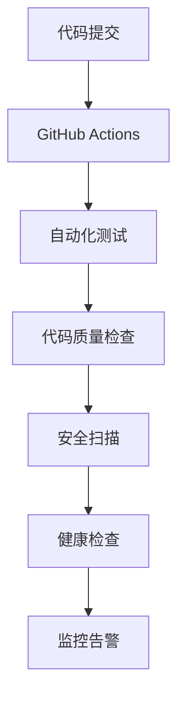

# 🚀 快递管理系统 CI/CD 指南

## 📋 概述

本指南介绍了快递管理系统的持续集成和持续部署(CI/CD)流程，包括自动化测试、构建、部署和监控。

## 🏗️ CI/CD 架构



## 🚀 快速开始

### 1. 启用GitHub Actions

1. 将代码推送到GitHub仓库
2. GitHub Actions会自动触发CI/CD流程
3. 在GitHub的Actions标签页查看运行状态

### 2. 本地测试

```bash
# 运行依赖测试
python test_imports.py

# 运行单元测试
python -m unittest discover -s unittest -p "test_*.py" -v


## 📊 工作流说明

### CI流程 (`.github/workflows/ci.yml`)

| 阶段 | 功能 | 触发条件 |
|------|------|----------|
| 🧪 测试 | 运行所有测试套件 | 每次push/PR |
| 🔍 质量检查 | 代码格式和复杂度检查 | 测试通过后 |
| 🔒 安全扫描 | 依赖漏洞和代码安全扫描 | 质量检查通过后 |
| 📦 构建 | 构建Docker镜像和可执行文件 | 安全扫描通过后 |
| 🚀 发布 | 创建GitHub Release | main分支push |

### 测试策略

#### 单元测试 (`unittest/`)
- ✅ 数据库操作测试
- ✅ 界面功能测试  
- ✅ 二维码处理测试
- ✅ 主程序流程测试

#### 集成测试
- ✅ 区块链功能测试（计划中）
- ✅ 依赖导入测试（计划中）
- ✅ 完整业务流程测试（计划中）

#### 性能测试
- ⚠️ 负载测试（计划中）
- ⚠️ 并发测试（计划中）

## 📞 支持和维护

### 获取帮助
- 📧 提交Issue到GitHub仓库
- 📖 查看项目文档
- 🔍 搜索已有解决方案

## 📚 相关文档
- [项目README](./README.md)
- [区块链配置指南](计划中)
- [使用指南](计划中)
- [测试文档](./unittest/readme.md)
